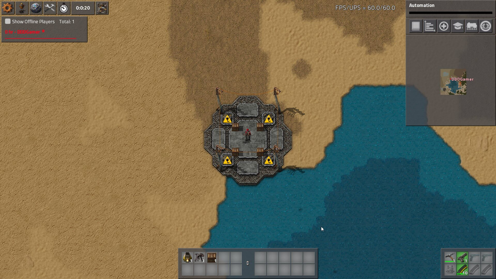
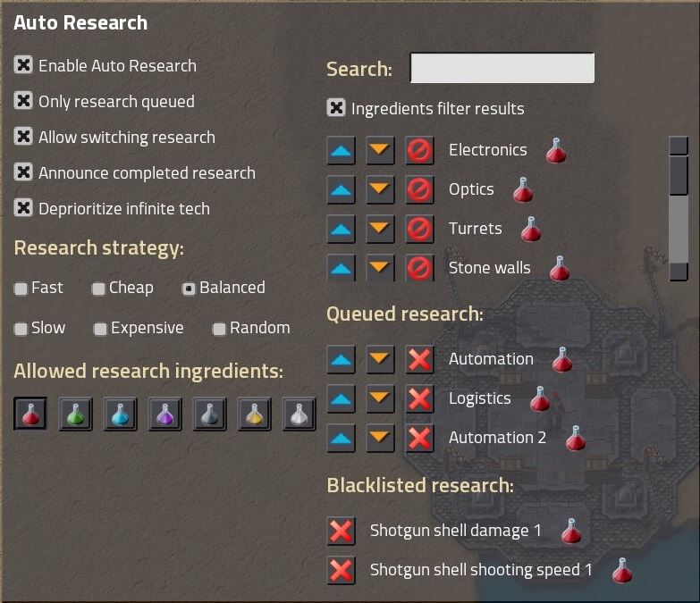
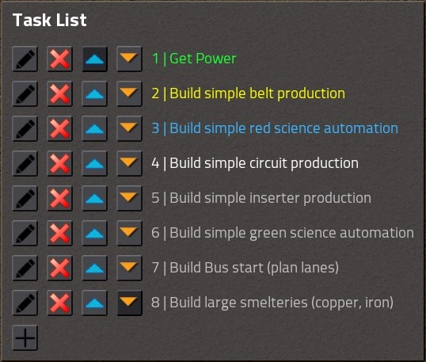
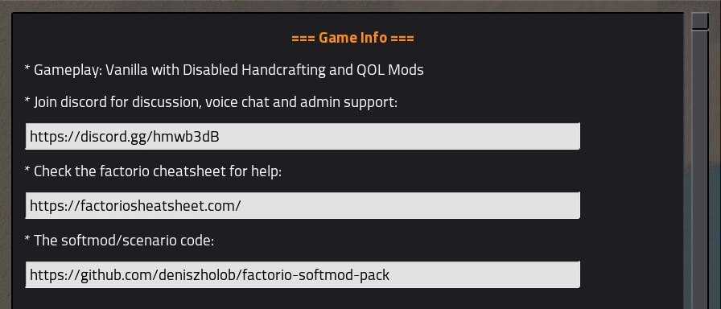
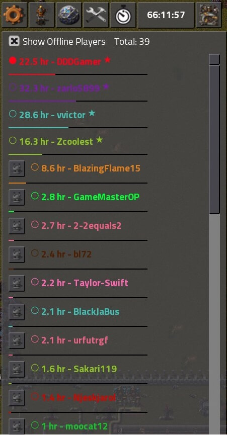

# DDDGamer's Factorio v0.16 Softmod Collection (Scenario) [](https://travis-ci.org/deniszholob/factorio-softmod-pack)

Contains QOL code to help out in the game such as automatic deconstruction of miners, death markers, tasks, player list, etc...

**What is a soft mod?**
A modification to the `control.lua` file.

**control.lua**
* Factorio folder location: `Factorio/data/base/scenarios/freeplay/`
* Scenario location: `%appdata%/Factorio/scenarios/<scenario_name>`
* Purpose: The file sets up the initial game and is downloaded onto all the clients automatically in multiplayer. The original vanilla file tells the game to give you items at the start of the game and gives you pistol + ammo upon respawn. Extension of this functionality brings "limitless possibilities". The Wave defence Scenario is one example of a softmod already packaged with the game.

## Support Me
If you found the pack or the source code useful, consider supporting me on Patreon.

[](https://www.patreon.com/deniszholob)

## Installation
* Download the softmod pack zipped file (`dddgamer-softmod-pack.zip`) from the
[Latest Release](https://github.com/deniszholob/factorio-softmod-pack/releases/latest)
* Extract to `%appdata%/Factorio/scenarios/`
* *(Optional)* Enable/disable softmod modules in the `control.lua` to your liking
* Launch Factorio
* Play -> Scenarios -> dddgamer-softmod-pack

### Add to an existing save
* Download the softmod pack zipped file (`dddgamer-softmod-pack.zip`) from the
[Latest Release]
* Browse to the save file (.zip archive file)
  * Local saves are in C:/Users/*[your-username]*/AppData/Roaming/Factorio/saves/
* Open your save game zip
  * (typically `_autosave1.zip` for autosaves on regular game or servers)
* Extract the softmod pack contents into the saved file replacing the control.lua


## Dev
Some notes to help the dev process.

**Notes:**
* Previous pack versions are saved on separate branches.
* This pack is not finalized, there are still some modules under development that are not listed in the `control.lua`


### Files
Dev files will be removed from the release build, see the [github repository](https://github.com/deniszholob/factorio-softmod-pack) for all the files.

```
.
├── .build-scripts/      <- Scripts for github/travis builds
├── locale/             <- Translation strings
├── modules/            <- The actual softmod modules
├── stdlib/             <- Factorio "standard library" classes, main one being the Event
├── util/               <- Contains some utility classes like colors, math, styles.
├── .code-templates.md  <- Some code snippets for development purposes.
├── config.lua          <- Just creates a config global for now.
├── control.lua         <- Entry file that loads all the other modules, configure what to load here.
└── README.MD           <- This file

```

### References
* [Factorio API](http://lua-api.factorio.com/latest/)
* [Factorio Wiki - Multiplayer](https://wiki.factorio.com/Multiplayer)
* [Factorio Wiki - Console](https://wiki.factorio.com/Console)
* [Factorio Wiki - Research](https://wiki.factorio.com/Research)
* [Factorio RElms - Console Commands](https://factorio-realms.com/tutorials/useful_factorio_console_commands)
* [Afforess/Factorio-Stdlib](https://github.com/Afforess/Factorio-Stdlib)
* [Afforess/Factorio-Stdlib Doc](http://afforess.github.io/Factorio-Stdlib/index.html)
* [3RaGaming/3Ra-Enhanced-Vanilla](https://github.com/3RaGaming/3Ra-Enhanced-Vanilla)
* [RedMew](https://github.com/Refactorio/RedMew)
* [Lua Doc](https://www.lua.org/manual/5.3/)
* [Lua tutspoint](https://www.tutorialspoint.com/lua/index.htm)

## Screenshots





