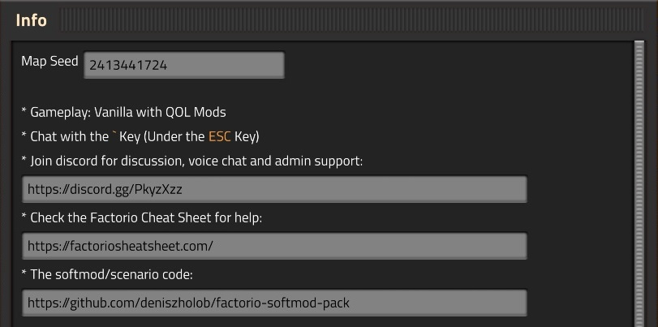
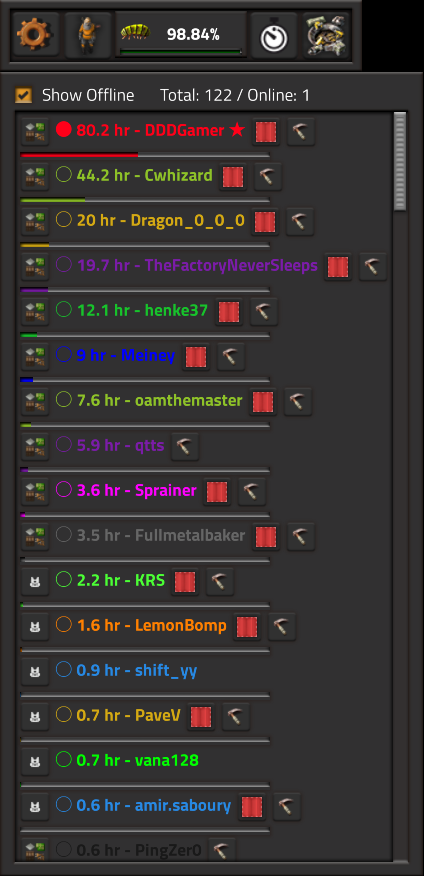
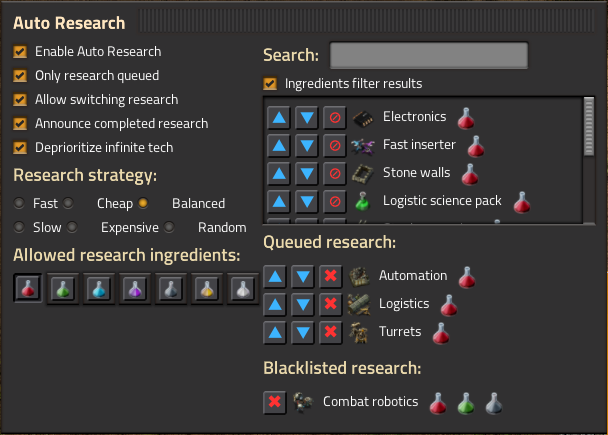
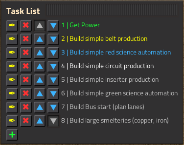

# DDDGamer's [Factorio](https://www.factorio.com/) v1.1 Softmod Collection (Scenario) 

Contains QOL code to help out in the game such as automatic deconstruction of miners, death markers, tasks, player list, etc...

**What is a soft mod?**
A modification to the `control.lua` file.

**control.lua**

* Factorio folder location: `Factorio/data/base/scenarios/freeplay/`
* Scenario location: `%appdata%/Factorio/scenarios/<scenario_name>`
* Purpose: The file sets up the initial game and is downloaded onto all the clients automatically in multiplayer. The original vanilla file tells the game to give you items at the start of the game and gives you pistol + ammo upon respawn. Extension of this functionality brings "limitless possibilities". The Wave defense Scenario is one example of a softmod already packaged with the game.

# Installation
* Download the softmod pack zipped file (`dddgamer-softmod-pack.zip`) from the
[Latest Release](https://github.com/deniszholob/factorio-softmod-pack/releases/latest)
* See the [installation instructions](https://github.com/deniszholob/factorio-softmod-pack/src/README.md)

# Support Me
If you find the cheat sheet or the source code useful, consider:

* Donating Ko-fi: https://ko-fi.com/deniszholob
* Supporting on Patreon: https://www.patreon.com/deniszholob

# Screenshots

